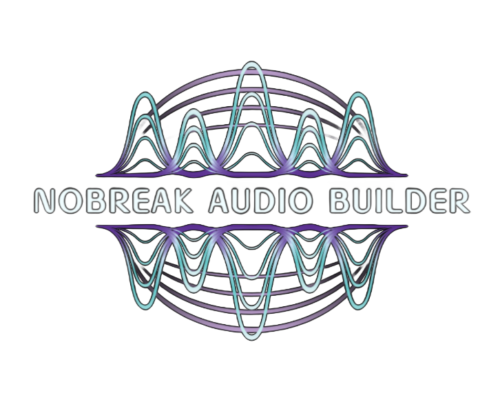
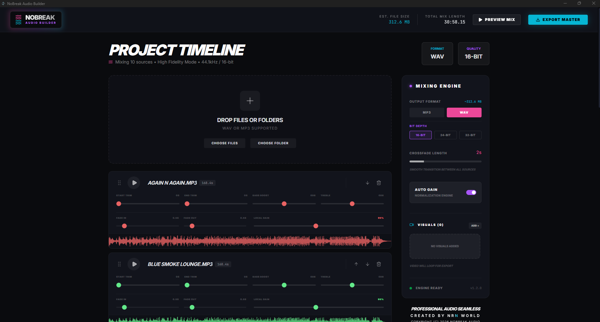
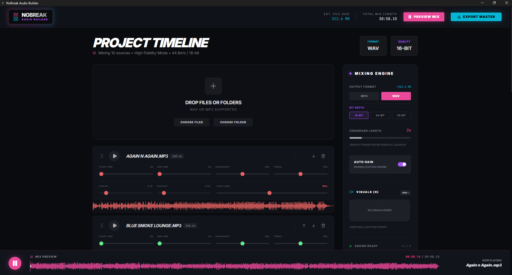
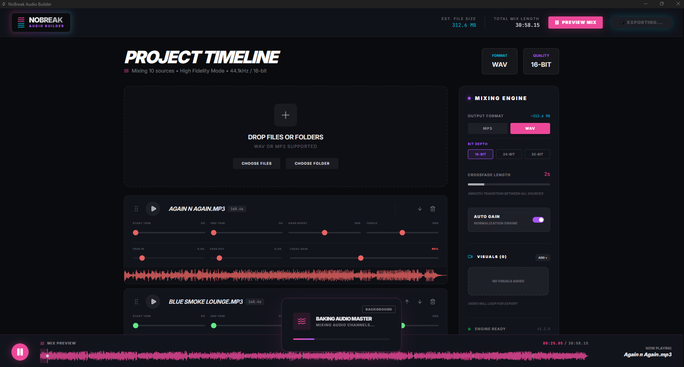
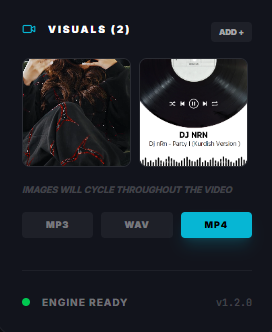
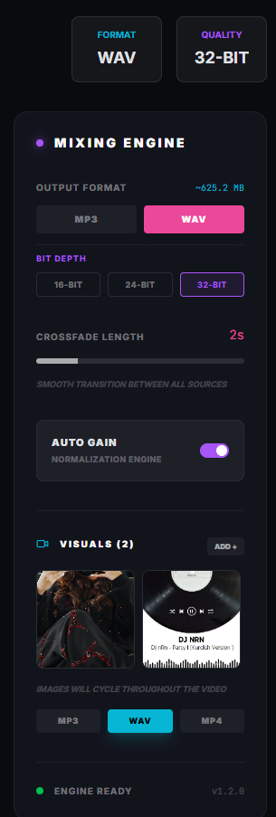

  
  <h1>🌊 NOBreak Professional Audio Builder</h1>
  
<strong>A high-performance, desktop-based audio mixer designed for creating seamless, gapless audio compilations.</strong>

  

    
    
    
  

 

NOBREAK is designed for creators who demand perfection. Whether you are building a DJ set, a continuous background loop, or a professional podcast sequence, NOBREAK ensures your transitions are perfectly timed and energetic. 

---

## 📸 Screenshots

| Main Workspace | Audio Mixing Engine |
| :---: | :---: |
|  |  |

| Visual Customization | Export & Build |
| :---: | :---: |
|  |  |

  <i>Track Management</i> 
  

---

## ✨ Key Features

- **Gapless Transitions:** Advanced crossfade engine (6s default) that overlaps tracks linearly to maintain volume and energy without any silence.
- **Individual Track Control:** Precise trimming, fade-in/out, and local gain adjustment for every individual file in your project.
- **Built-in EQ:** Per-track Bass and Treble adjustment for sonic consistency across different recordings.
- **Auto-Normalization:** A built-in engine that ensures all tracks in your project maintain a consistent loudness level.
- **Visual Personalization:** Upload custom backgrounds or animated GIFs to create a branded, personal workspace while you edit.
- **Unique Identity:** Every track is automatically assigned a unique color hue for extremely easy visual navigation on the timeline.
- **Desktop Ready:** Built natively for Windows with Electron, providing a fast, standalone application experience with seamless auto-update capabilities.

---

## 🚀 Getting Started

1. **Upload:** Drag and drop your audio files directly into the application (Supports MP3 & WAV).
2. **Arrange:** Simply drag tracks up or down to change their playback order.
3. **Tweak:** Adjust trims, fade lengths, and EQ settings to find the perfect overlap point between tracks.
4. **Export:** Mix down your entire project to a single high-quality audio file with one click.

---

## 🛠 Tech Stack

- **Frontend:** React 18, Vite, Tailwind CSS
- **Audio Engine:** Web Audio API (High-performance Client-side processing)
- **Animations:** Motion (Framer-Motion)
- **Shell:** Electron (Native Windows Desktop Build & Background Auto-Updater)

---

## 📄 License

This software is provided under a **Proprietary License**. 
**Commercial use, modification, distribution, and reverse engineering are strictly prohibited.**
For educational, private, and personal use only. Nobody is allowed to make money from this software or its marketing. 
See the [LICENSE.txt](./LICENSE.txt) file for the full legal terms.

   
  Built by nRn World

---

☕ **Support development**: [Buy me a coffee 💜](https://ko-fi.com/nrnworld)

Created by ❤️ © nRn World
